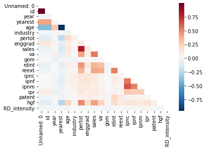
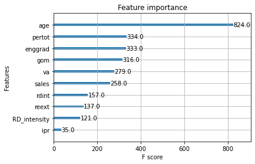

```{r setup, include=FALSE}
knitr::opts_chunk$set(echo = FALSE)
```

## Presentation

[Source of Data]{.underline} : the Survey on Buisiness Strategies

-   2000 manufacturing companies

-   121 992 observations

-   16 variables period : 1990-2012

[GOAL]{.underline} : Predict which company is going to be a HGF in the last of year of the sample

## Steps

### NA Treatment

-   For the yearest, use the minimum of the id

-   id = 0 : delete

-   use the mean of the value before and after the value when there are a value for another same id

-   Use the median imputation for variables with remaining missing values

### Outliers Treatment

-   Delete the 2 outliers in the "gom" column, which was extremely high comparing to the rest of the column

### Creating new variables

-   age, HGF and R&D

 Matrix of correlation

## Model

|                | Logistic regression | SVM   | K nearest neighbors | Decision tree | Random forest | XG Boost |
|-----------|-----------|-----------|-----------|-----------|-----------|-----------|
| Test accuracy  | 0.117               | 0.994 | 0.997               | 0.997549      | 0.999057      | 0.999246 |

: *Accuracy of the models*

## Results and conclusion


